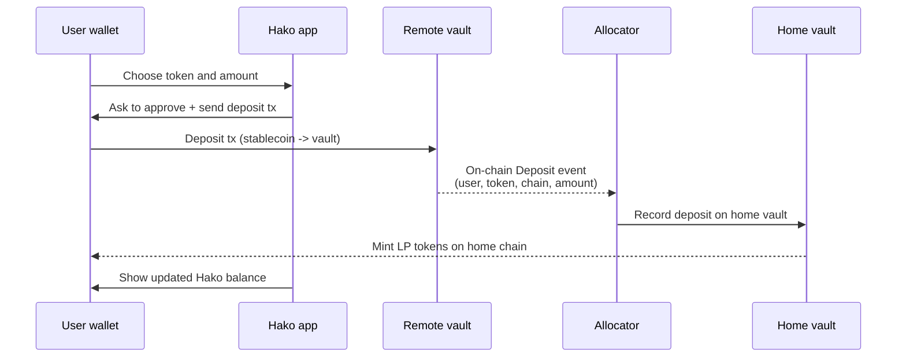
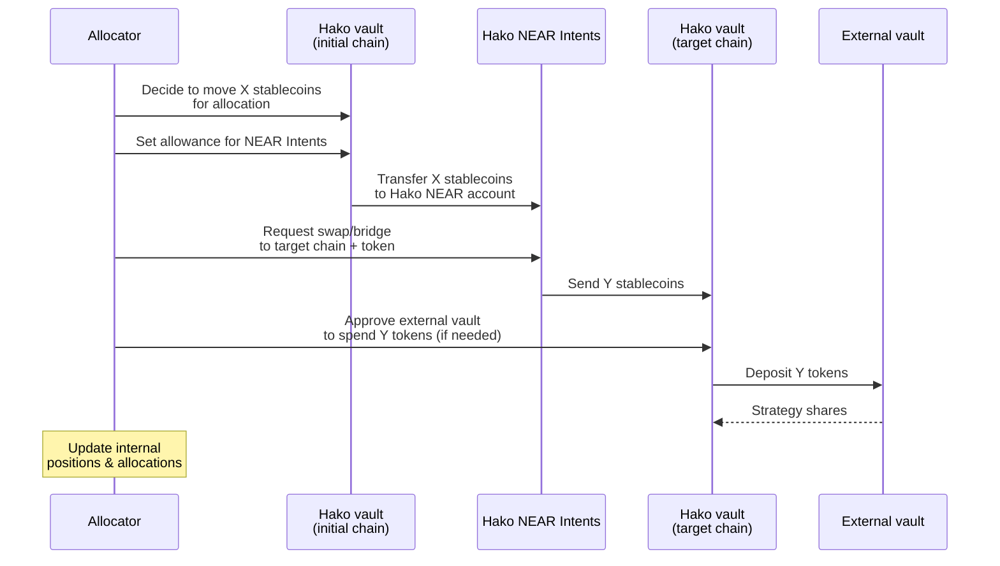

# Vault Allocations

### Big picture

At a high level, Hako's allocation system connects 4 layers:

* Users wallets.
* Hako vault contracts.
* NEAR Intents as a cross-chain and swapping layer.
* External stablecoin vaults and protocols.

### Hako Vault Contracts

Even though users can deposit on many chains, Hako is managed as one global pool of stablecoin value.

There are two types of Hako vault contracts: the **home** vault and **remote** vaults.

<table><thead><tr><th width="202.1328125">Feature</th><th>Home Vault</th><th>Remote Vault</th></tr></thead><tbody><tr><td><strong>Location</strong></td><td>"Home" chain (<em>Polygon</em>)</td><td>Each supported additional chain</td></tr><tr><td><strong>Role</strong></td><td>Global accounting and core vault logic</td><td>Chain entry point and liquidity holder</td></tr><tr><td><strong>LP token</strong></td><td>Mints and burns the vault LP token</td><td>Does not mint LP tokens</td></tr><tr><td><strong>View of total assets</strong></td><td>Tracks the full vault AUM across all chains</td><td>Tracks only local balances and positions</td></tr><tr><td><strong>Withdrawals</strong></td><td>Hosts the withdrawal queue and finalizes burns</td><td>May be used to pay out withdrawals on that chain</td></tr><tr><td><strong>Controllers / operations</strong></td><td>Main control point for strategy and queues</td><td>Operated by the same controllers for local actions</td></tr><tr><td><strong>External strategies</strong></td><td>Can hold and manage positions on its own chain</td><td>Can hold and manage positions on their own chain</td></tr></tbody></table>

The **home vault** is the core of the system. It lives on the home chain and is the only contract that mints and burns the vault LP token. It maintains the global view of total assets under management, the withdrawal queue, and the relationship between LP supply and asset value.

**Remote vaults** extend this vault to other chains. They allow users to deposit stablecoins directly on those chains, hold local liquidity, and integrate with local strategies. Each remote vault emits events that the off-chain allocator uses to update the home vault’s accounting and to decide how much capital should stay local, be invested into local protocols, or be moved out via NEAR Intents.


**Together, the home vault and remote vaults behave like one unified vault:**

* Users can enter from multiple chains, but their position is always represented by the LP token on the home chain.
* Local liquidity and strategies live on remote vaults where it makes sense operationally.
* Global decisions about allocations, share price, and withdrawals are anchored in the home vault.


### From deposits to external vaults

#### Deposit Lifecycle

At the user level, a deposit is simple: you send stablecoins to a Hako vault and receive LP tokens. Internally, there is a coordinated on-chain and off-chain flow involving remote vaults, the home vault, and the allocator.

From this point on, the deposit is fully included in the global pool, and the allocator can decide how to allocate that liquidity.

#### Asset Allocation Lifecycle

> **Source vault to NEAR**
>
> The allocator selects a source vault that currently holds liquid stablecoins. It instructs the vault to approve the NEAR Intents contract for a specific amount, then calls NEAR Intents to pull those tokens into the Hako NEAR account.
>
> **On NEAR**
>
> Inside NEAR Intents, the assets can be:
>
> * Swapped between stablecoins
> * Prepared quote to be bridged to a target chain
>
> **NEAR to target vault**
>
> NEAR Intents sends the selected stablecoin to a Hako vault on the target chain. This may be the same contract that accepts user deposits on that chain or a dedicated vault address.
>
> **Target vault to external vault**
>
> On the target chain, the Hako vault:
>
> * Approves the external vault contract to use the received stablecoins.
> * Calls the external vault's deposit function.
> * Receives strategy shares that represent its position in that external vault.

### Withdrawal Lifecycle

This section explains what happens inside Hako after you request a withdrawal. It focuses on internal mechanics and how withdrawals interact with vault allocations.


[withdrawal-queue.md](withdrawal-queue.md)


### Hako Admin Wallet

Most operational transactions in Hako are signed by a dedicated `Admin Wallet`. This wallet triggers on-chain actions on the home and remote vaults: recording deposits that arrived on remote chains, moving liquidity between vaults and NEAR Intents, interacting with external vaults, and finalizing withdrawals.

User actions stay under user control: deposits are normal token transfers from user wallets, and withdrawals are authorized by users signing typed messages.

`Admin Wallet` can move vault liquidity within the allowed paths of the protocol, it is part of the overall risk model. If this key were ever compromised, an attacker could attempt to use the same operational permissions that the allocator uses.


To reduce this single-key risk and better match institutional expectations, we plan to migrate `Admin Wallet` to an **MPC-based** setup, where control is split across multiple parties and no single key is sufficient to operate it.

