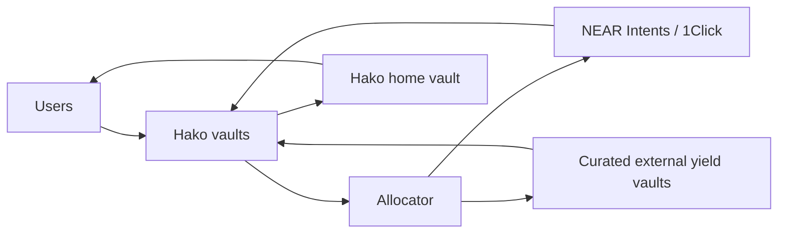
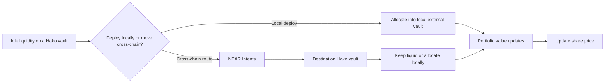

# Smart Allocation

Hako is designed to feel like one vault product, even when liquidity is spread across multiple chains and multiple external yield vaults.
Users interact with a simple deposit and withdrawal flow, while the system manages where capital is held, where it is routed, and where it is deployed.

At any point in time, vault assets may sit as liquid balances inside Hako vaults, move through cross-chain routing, 
or be allocated into curated external vaults. For product-specific details about the current stablecoin vault, see [Stable Vault](../vaults/stable-vault.md).

## Structure

Hako combines several layers into one portfolio system.

| Layer           | Role                                                                        |
|-----------------|-----------------------------------------------------------------------------|
| Home vault      | Canonical accounting for managed assets, user shares, and portfolio value   |
| Remote vaults   | Local entrypoints for deposits, liquidity, and payouts on additional chains |
| Allocator       | Decides how capital should be positioned across the system                  |
| NEAR Intents    | Routes assets across chains and between supported stablecoins               |
| External vaults | Curated third-party vaults where capital can be deployed for yield          |

Together, these layers let Hako operate as one vault product across multiple chains.

```mermaid
flowchart LR
  U["Users"] --> V["Hako vaults"]
  V --> A["Allocator"]
  A --> N["NEAR Intents / 1Click"]
  A --> E["Curated external yield vaults"]
  N --> V
  E --> V
  V --> H["Hako home vault"]
  H --> U
```

## How Capital Gets Allocated

Hako does not route funds into arbitrary opportunities.
Capital is only allocated into curated external vaults and supported assets that Hako has reviewed operationally and enabled onchain.
This creates two layers of control: vault selection at the protocol level and execution approval at the vault level.

If a vault is removed from new allocations, that does not mean capital is trapped.
Hako can stop sending fresh funds there while still unwinding existing positions and returning liquidity back into Hako-controlled vault balances.

Strategy updates are handled as a portfolio problem rather than a single-vault toggle.
The allocator compares approved opportunities across chains, spreads capital across multiple vaults, 
and rebalances when relative opportunity, available liquidity, or portfolio shape changes. 
The goal is not to chase one source of yield, but to maintain a diversified allocation across the approved universe.

The allocator also distinguishes between same-chain and cross-chain deployment. 
If the required liquidity already exists on the right chain in the right asset, Hako can deploy it locally. 
If not, capital is first routed to another Hako vault and only then deployed from that destination vault into a local external vault.

## Using NEAR Intents

Hako uses [NEAR Intents](https://docs.near-intents.org/) as its routing layer when assets need to move between vaults on different chains.
In practice, that means one cross-chain operation can include both the bridge step and, when needed, a swap from one supported stablecoin into another.

The flow is simple:

1. Liquidity leaves a source Hako vault.
2. NEAR Intents / 1Click routes it to the target chain.
3. The destination Hako vault receives the funds.
4. From there, Hako can either keep the liquidity available or allocate it into a local external vault.

This separation matters. Hako does not treat cross-chain routing and external deployment as one combined action.
Funds arrive at a destination Hako vault first, and only then can that vault decide whether to keep them liquid or deploy them locally.

For the user-facing side, see [Swap](../learn/swap.md).

```mermaid
graph LR
  S["Idle liquidity on a Hako vault"] --> D{"Deploy locally or move cross-chain?"}
  D -->|Local deploy| L["Allocate into local external vault"]
  D -->|Cross-chain route| N["NEAR Intents"]
  N --> T["Destination Hako vault"]
  T --> O["Keep liquid or allocate locally"]
  L --> P["Portfolio value updates"]
  O --> P
  P --> H["Update share price"]
```

## Vault Share Price

Hako keeps one canonical view of managed assets and one share price for the vault product.
That share price is based on the full portfolio, not just the idle balances visible on one chain.

In practice, that portfolio view includes liquid balances held in Hako vaults, assets deployed into external vaults, 
and assets that are temporarily moving through the cross-chain routing layer. 
As positions change, Hako refreshes portfolio state across chains and reconciles those balances and positions back into the home-vault accounting layer.

That is what allows deposits, withdrawals, and share value to stay tied to the total portfolio rather than to one local liquidity pool. 
Users enter from different chains, but the vault product still behaves like one managed pool.

## Controls

Operational actions in Hako are executed through the Hako Multisig Wallet, using [Safe multisig](https://docs.safe.global/advanced/smart-account-overview).

Hako Multisig Wallet is used for:

- Rebalancing liquidity between Hako vaults
- Routing assets through NEAR Intents
- Allocating into, or unwinding from, approved external vaults
- Enabling or disabling supported vaults and operational settings
- Completing the cross-chain operational steps required to keep deposits, withdrawals, and portfolio accounting in sync

The multisig controls protocol operations around allocation, routing, and settlement across chains.
At the same time, users still initiate deposits from their own wallets, and withdrawals still begin from user-authorized requests.


As Hako expands its public tooling, this control layer can be extended with third-party validators once the public SDK is ready.


For the broader trust and risk model behind these operations, see [Risks](risks.md).
