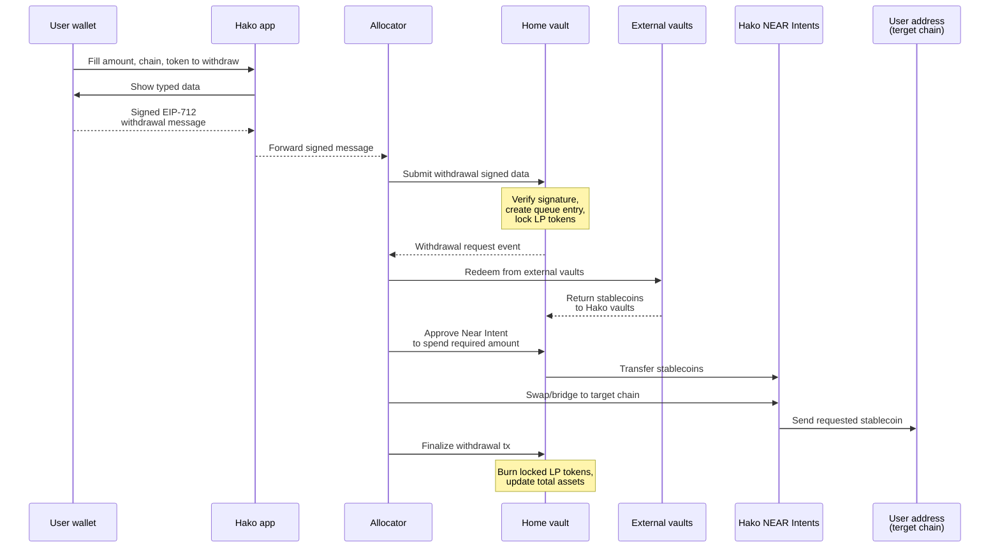

# Withdrawal Queue

When you request a withdrawal in the app, you only sign a message. &#x20;

The signed request is picked up by the allocator, sent to the `home vault` as an on-chain transaction, and turned into an entry in the withdrawal queue.&#x20;

**Then, the allocator engine:**

1. Locks the requested part of your LP position in the home vault.
2. Prepares liquidity by redeeming from external vaults and moving funds through NEAR Intents.
3. Sends tokens to your address on the chosen destination chain.
4. Updates the home vault to reflect that this portion of your position has been paid out and burned.


The queue exists so that all of this can be done in order, in batches, and in sync with vault allocations and cross-chain movements.


