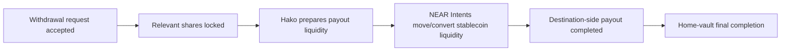

# Withdrawal Queue

## What Is It

The withdrawal queue is not just a waiting list. 
It is the part of Hako that turns an accepted withdrawal request into an actual payout while keeping the vault's portfolio and share accounting consistent across chains.

At a high level, the queue has three jobs:

1. Record that a withdrawal has been accepted on-chain.
2. Lock the corresponding portion of the user's vault position.
3. Coordinate payout and final accounting in the correct order.

Entering the queue does not mean liquidity is already sitting idle and reserved for immediate payout. 
It means the withdrawal has been accepted into the vault's canonical lifecycle and will now be processed against available liquidity, routing, and accounting rules.

## Request Acceptance

Once a withdrawal request is accepted, the relevant portion of the user's vault position is locked. 
Those shares still belong to the user, but they are no longer available to transfer or reuse while the allocator prepares the withdrawal.


Home vault accepts withdrawals through `requestWithdrawal(...)` or `requestRedeem(...)`, and Hako closes the lifecycle with `completeWithdrawal(...)`. See [Contract Schema](../vaults/contract-schema.md).


## Liquidity

Hako does not assume that the destination side already holds enough of the exact payout token for every request.
Instead, it prepares liquidity in stages, using the least disruptive source first.

At a high level, Hako tries to:

1. Use idle balance already sitting on the destination side.
2. If needed, redeem liquidity from external positions.
3. If needed, convert supported stablecoin liquidity already on that chain.
4. If needed, move liquidity from another Hako vault.

A request may spend time in processing, because Hako is preparing the correct liquidity on the correct chain in the correct payout asset.

## NEAR Intents

Hako uses [NEAR Intents](https://docs.near-intents.org/) to route liquidity between Hako-controlled vaults. 
It is part of how Hako prepares the payout location, not a replacement for the vault-level payout flow itself.

In practice, NEAR Intents:

- move stablecoin liquidity from one Hako vault to another across chains
- convert between supported stablecoins as part of that movement
- deliver the required liquidity into the destination Hako vault before payout is attempted

Liquidity is prepared between Hako-controlled vaults first. 
Only after it arrives on the destination side can Hako complete the user payout there. 
For a broader view of how routing fits into the portfolio, see [Smart Allocation](vault-allocations.md).

```mermaid
graph LR
  A["Withdrawal request accepted"] --> B["Relevant shares locked"]
  B --> C["Hako prepares payout liquidity"]
  C --> D["NEAR Intents move/convert stablecoin liquidity"]
  D --> E["Destination-side payout completed"]
  E --> F["Home-vault final completion"]
```

## Finalization

“Paid out” and “fully completed” are not always the same moment.

If the withdrawal is completed on the home chain, payout and final completion can happen together. 
If the withdrawal is completed on another chain, the destination-side payout can happen first, and the home vault closes the canonical accounting afterwards.

That final home-vault completion is what makes the withdrawal fully complete from the vault's perspective. 
It closes the canonical withdrawal lifecycle, burns the locked shares, and updates the unified accounting for the product.

The user-facing progression is:

1. **Request accepted**
2. **Processing**
3. **Payout completed**
4. **Finalized**


Treat only the final stage as full completion from the vault's perspective. A withdrawal may already be paid out on the destination side while final home-vault accounting is still being closed.

