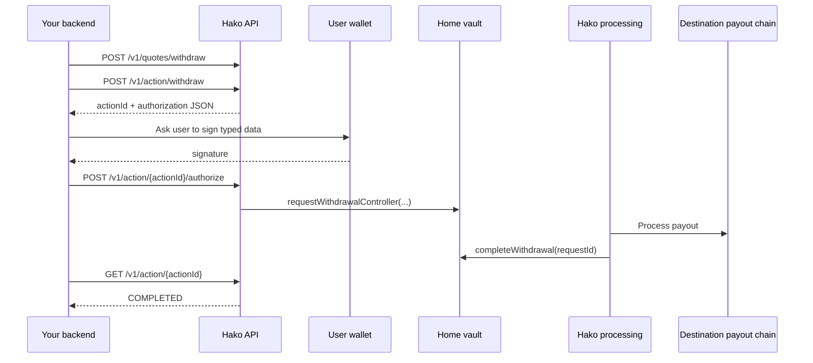

# Withdrawal Flow

Hako withdrawals are authorization-based.
Your integration creates a withdrawal action, your user signs the typed-data payload returned by the API,
and Hako submits and processes the on-chain request on the user's behalf.
This means the partner flow is centered around signing and authorization rather than broadcasting a user transaction directly.


This page is intentionally workflow-first.
For the full request and response contract, use the published [API](api/README.md) page or CLI example [Github](https://github.com/hakolabs/hako-integration-example).


## Flow At A Glance



## 1. Get Withdrawal Quote

Use `POST /v1/quotes/withdraw` if you want a route, fee, and timing estimate before creating a live action.

```bash
curl -sS -X POST "$HAKO_API/quotes/withdraw" \
  -H "Content-Type: application/json" \
  -H "X-API-Key: $PARTNER_KEY" \
  -d '{
    "strategyId": "stable_vault",
    "fromAccount": "0x1111111111111111111111111111111111111111",
    "mode": "amount",
    "amount": "1",
    "withdrawTo": {
      "account": "0x2222222222222222222222222222222222222222",
      "network": "base",
      "assetId": "USDC"
    }
  }'
```

Response excerpt:

```json
{
  "expiresAt": "2026-03-07T13:00:00.000Z",
  "authorization": {
    "method": "signature",
    "gasless": true
  },
  "withdrawTo": {
    "account": "0x2222222222222222222222222222222222222222",
    "network": "base",
    "assetId": "USDC"
  },...
}
```

CLI:

```bash
npm run quote:withdraw -- --chain base --token USDC --amount 1
```

Notes:
- `withdrawTo.network` and `withdrawTo.assetId` define the payout target.

## 2. Create Withdrawal Action

Use `POST /v1/action/withdraw` to create the live withdrawal action.

```bash
curl -sS -X POST "$HAKO_API/action/withdraw" \
  -H "Content-Type: application/json" \
  -H "X-API-Key: $PARTNER_KEY" \
  -d '{
    "strategyId": "stable_vault",
    "externalId": "partner-withdraw-20260307-001",
    "address": "0x1111111111111111111111111111111111111111",
    "receiver": "0x2222222222222222222222222222222222222222",
    "network": "base",
    "amount": "1",
    "token": "USDC"
  }'
```

Response excerpt:

```json
{
  "id": "7797f2f3-1cb8-449d-9f8d-16754df73f06",
  "type": "withdraw",
  "status": "NEW",
  "receiver": "0x2222222222222222222222222222222222222222",
  "expiresAt": "2026-03-07T13:00:00.000Z",
  "authorization": "{\"domain\":{...},\"types\":{...},\"primaryType\":\"WithdrawalAuthorization\",\"message\":{...}}"
}
```

CLI:

```bash
npm run withdraw -- --chain base --token USDC --amount 1
```

Important points:
- `network` is the destination payout network.
- if `receiver` is omitted, it defaults to `address`

## 3. Sign The Typed Data

The `authorization` field returned by `POST /v1/action/withdraw` is a JSON string. Parse it and sign it as EIP-712 typed data.

The typed data uses `primaryType: WithdrawalAuthorization`.

```ts
const authorization = JSON.parse(action.authorization);
const signature = await walletClient.signTypedData({
  account,
  ...authorization,
});
```

## 4. Authorize Action

Use `POST /v1/action/:actionId/authorize` after you have the user signature.

```bash
curl -sS -X POST "$HAKO_API/action/<ACTION_ID>/authorize" \
  -H "Content-Type: application/json" \
  -H "X-API-Key: $PARTNER_KEY" \
  -d '{
    "signature": "<SIGNATURE>"
  }'
```

Response excerpt:

```json
{
  "status": "ok",
  "txHash": "0x4ca8a43f1b800ce3edaed2faece0ea55566f4768ba22cb0fa10e60150587be52"
}
```

Important points:

- withdrawals do not use `/report`
- re-authorize can safely return the same tx hash again
- if the payload expired, create a new action and sign again
- if the withdrawal nonce changed, create a new action and sign again

## 5. Track Status

Poll `GET /v1/action/:actionId` until the action is final.

```bash
curl -sS "$HAKO_API/action/<ACTION_ID>" \
  -H "X-API-Key: $PARTNER_KEY"
```

CLI:

```bash
npm run action:get -- --action-id <ACTION_ID>
```

```bash
npm run action:watch -- --action-id <ACTION_ID>
```

| Status             | Meaning                                                               |
|--------------------|-----------------------------------------------------------------------|
| `NEW`              | Action created, waiting for authorization                             |
| `PROCESSING`       | Authorization accepted and Hako is processing the withdrawal          |
| `COMPLETING`       | Payout execution is in progress                                       |
| `PAYOUT_COMPLETED` | The payout leg is done, but final home-vault accounting is still open |
| `COMPLETED`        | Final success                                                         |
| `FAILED`           | Terminal failure                                                      |
| `CANCELLED`        | Terminal cancellation                                                 |


Treat only `COMPLETED` as final success. Do not stop at `PAYOUT_COMPLETED`.

