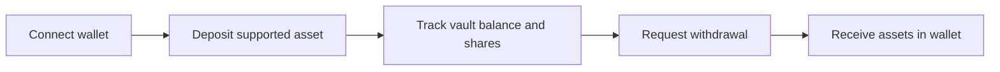

# Getting Started

Hako is a DeFi yield protocol built around vaults. You deposit supported assets into a vault and receive **vault shares** that represent your ownership.

From there, you can track your position and withdraw back to your wallet when you need to.

Start here: [app.hakolabs.app](https://app.hakolabs.app)

## In 2 minutes

1. Connect your wallet.
2. Deposit into a vault.
3. Track your position and withdraw when needed.

You can jump straight to the full walkthroughs:

* [Deposit](deposit.md)
* [Withdrawal](withdrawal.md)
* [Swap](swap.md) (swap or bridge assets to what you need)

## Before you begin

To use Hako, you need:

1. A supported EVM wallet connected through Hako, such as MetaMask, Rabby, Rainbow, or another compatible wallet
2. A supported asset on a supported network

If you need to swap or bridge into the right asset or network, start here: [Swap](swap.md)

## At a glance

## Key concepts (quick glossary)

* **Vault**: a container you deposit into, designed to earn yield.
* **Vault shares**: a receipt token that represents your ownership in the vault.
* **APY**: an estimate of annualized yield; it can change over time.
* **Network fees (gas)**: fees paid to the network to include transactions; not paid to Hako.
* **Supported networks**: where Hako is live today. See [Supported Networks](../supported-networks.md).

## Step 1: Connect your wallet

Make sure your wallet is installed and unlocked, then open the Hako app and press `Connect wallet`.

Choose your wallet type (MetaMask, WalletConnect, etc.), approve the connection, and ensure your wallet is on a supported network.


Hako cannot move funds without your wallet confirming a transaction (or signing a message where applicable).


<figure><figcaption></figcaption></figure>

## Step 2: Choose network + token

Choose the network and token you want to use in the deposit form.

If your wallet is on the wrong network, switch networks in your wallet first. See: [Supported Networks](../supported-networks.md)

Follow the full walkthrough here: [Deposit](deposit.md)

## Step 3: Make your first deposit

At a high level, depositing looks like this:

1. Select the asset and amount you want to deposit.
2. If this is your first time depositing that asset, you will approve it once.
3. Confirm the deposit transaction in your wallet.
4. After confirmation, you hold vault shares and can track your position.


Token approvals are normal in DeFi. They allow the vault to use your selected asset for deposits.


For exact UI steps, use the deposit guide: [Deposit](deposit.md)

## Step 4: Track your position

After your deposit confirms, you can see your vault balance (your position) and an APY estimate.
APY is indicative, not guaranteed, and balances may update only after the relevant confirmations complete.

## Step 5: Withdraw

Withdrawals may not be instant. In general, you will:

1. Request a withdrawal.
2. Wait while it is processed.
3. Receive assets back in your wallet.


Withdrawals are usually completed in under 30 minutes, but timing is not guaranteed and depends on network and market conditions.


Follow the full walkthrough here: [Withdrawal](withdrawal.md)

## If you need to swap or bridge

If you do not have the right asset or you are on the wrong network, you can swap and bridge before depositing. See: [Swap](swap.md)
